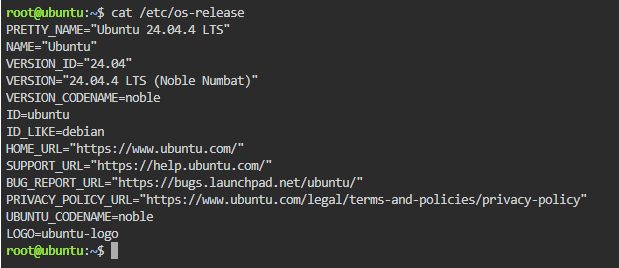
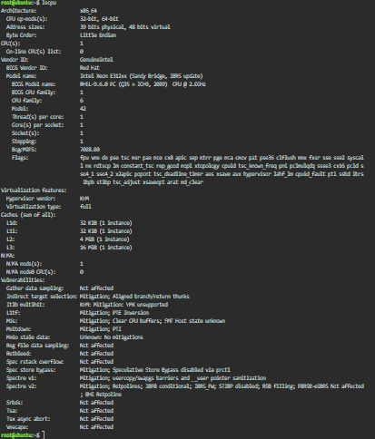
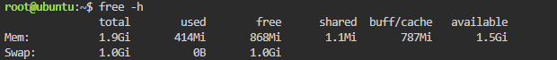
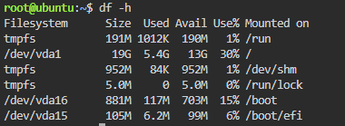

# Laboratory 03 - Multi-Cloud Explorer

Name: BENJIE VIRAY  
Course and Section: BSIT 4F
## KillerCoda Linux System Investigation

### System Information

| Category | Details |
|---|---|
| Operating System | Ubuntu 24.04.4 LTS (Noble Numbat) |
| CPU | Intel Xeon E312xx (Sandy Bridge, IBRS update) |
| Architecture | x86_64 |
| CPU Count | 1 |
| CPU Speed | 2.0 GHz |
| Memory | 1.9 GiB |
| Disk | 19 GB total |
| Disk Used | 5.4 GB |
| Disk Available | 13 GB |
| Disk Usage | 30% |

### Commands Used

- `cat /etc/os-release` - identifies the operating system and version.
- `lscpu` - displays CPU and architecture information.
- `free -h` - displays memory information.
- `df -h` - displays disk usage and available storage.

### Commands Used

- `cat /etc/os-release` - identifies the operating system and version.
- `lscpu` - displays CPU and architecture information.
- `free -h` - displays memory information.
- `df -h` - displays disk usage and available storage.

### Screenshot Evidence

#### Operating System

#### CPU Information

#### Memory

#### Disk Space

## Cloud Hosting Options

### AWS

**Amazon EC2 (Elastic Compute Cloud)** can host the Ubuntu Linux server as a virtual machine. It provides configurable CPU, memory, storage, and networking resources.

### Microsoft Azure

**Azure Virtual Machines** can host the Ubuntu Linux server in a cloud-based virtual machine. It allows users to select the required computing resources and Linux operating system image.

### Google Cloud Platform

**Google Compute Engine** can host the Ubuntu Linux server as a virtual machine. It provides configurable CPU, memory, storage, and networking resources.

## Conclusion

The Linux environment investigated in KillerCoda can be migrated to AWS, Microsoft Azure, or Google Cloud Platform. The equivalent cloud services are Amazon EC2, Azure Virtual Machines, and Google Compute Engine because all three can run Ubuntu-based Linux virtual machines.
