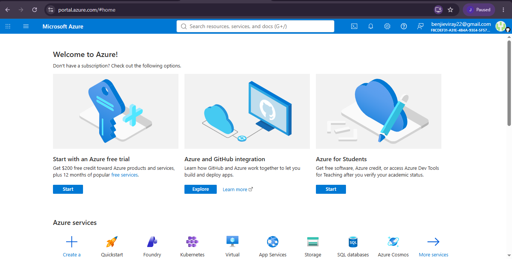

# Microsoft Azure Research

## Brief Overview

Microsoft Azure is a cloud computing platform developed by Microsoft. It provides cloud services for computing, storage, networking, databases, artificial intelligence, and other enterprise applications.

## Global Infrastructure

Azure operates through a global network of regions and data centers. These regions allow organizations to deploy applications closer to their users and improve availability and performance.

## Cloud Management Console

The Azure Portal is the web-based management console used to create, configure, monitor, and manage Azure resources and services.

## Four Core Services

1. Azure Virtual Machines
2. Azure Blob Storage
3. Azure Virtual Network
4. Azure SQL Database

## Three Advantages

1. Strong integration with Microsoft products and technologies.
2. Wide range of enterprise cloud services.
3. Global infrastructure that supports scalable and highly available applications.

## Typical Enterprise Use Cases

- Hosting enterprise applications
- Migrating Windows Server workloads
- Cloud database management
- Backup and disaster recovery
- Artificial Intelligence and Machine Learning

## Screenshot Evidence

Screenshot of the official Microsoft Azure website or Azure Portal.
## Screenshot Evidence

## Sources

- [Microsoft Azure Official Website](https://azure.microsoft.com/)
- [Microsoft Azure Documentation](https://learn.microsoft.com/azure/)
