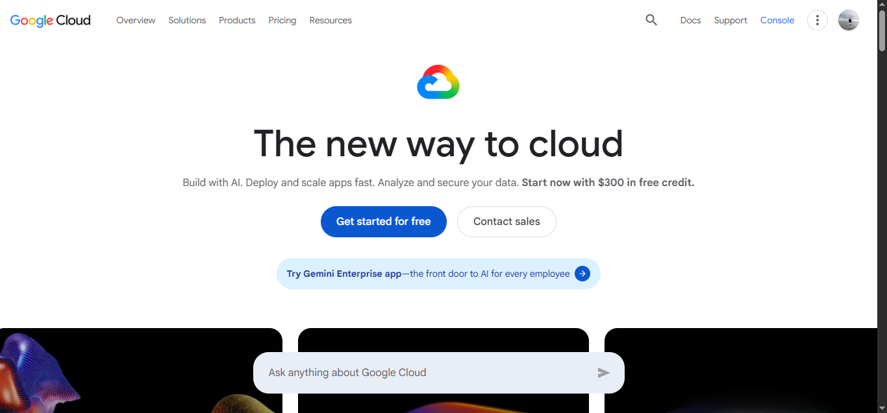

# Google Cloud Platform Research

## Brief Overview

Google Cloud Platform (GCP) is a cloud computing platform developed by Google. It provides services for computing, storage, networking, databases, artificial intelligence, machine learning, and application development.

## Global Infrastructure

Google Cloud operates a global infrastructure consisting of regions and zones located around the world. This infrastructure allows organizations to deploy applications with high availability, scalability, and reliable performance.

## Cloud Management Console

Google Cloud Console is the web-based management interface used to create, configure, monitor, and manage Google Cloud resources and services.

## Four Core Services

1. Compute Engine
2. Cloud Storage
3. Virtual Private Cloud (VPC)
4. Cloud SQL

## Three Advantages

1. Strong capabilities in Artificial Intelligence and Machine Learning.
2. Excellent support for Kubernetes and containerized applications.
3. Google's global network provides fast and reliable connectivity.

## Typical Enterprise Use Cases

- Hosting web and enterprise applications
- Artificial Intelligence and Machine Learning
- Big Data analytics
- Kubernetes and containerized applications
- Cloud database management
## Screenshot Evidence

## Sources

- [Google Cloud Official Website](https://cloud.google.com/)
- [Google Cloud Documentation](https://cloud.google.com/docs)
